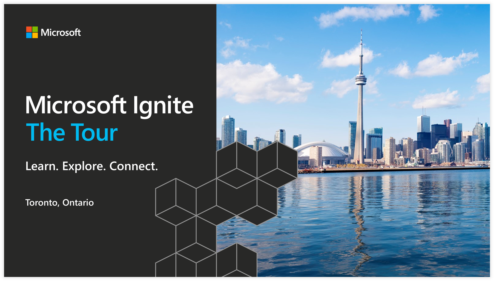

# 2018 Microsoft Ignite Tour Toronto Demos

 

These are my Azure Pipelines demos for the Microsoft Ignite Tour Toronto.

## Features

This project demonstrates the following:

* [Azure Pipelines](https://azure.microsoft.com/en-au/services/devops/pipelines/?WT.mc_id=msignitethetour-github-dev20)
* [Azure Pipelines App for GitHub](https://github.com/marketplace/azure-pipelines)
* [Azure DevOps Deployment Gates](https://docs.microsoft.com/en-us/azure/devops/pipelines/release/approvals/gates?WT.mc_id=msignitethetour-github-dev20)
* [Azure App Service Deployment Slots](https://docs.microsoft.com/en-us/azure/app-service/web-sites-staged-publishing?WT.mc_id=msignitethetour-github-dev20)

## Additional Links

* [Azure DevOps Documentation](https://docs.microsoft.com/en-us/azure/devops/index?WT.mc_id=MSIgniteTheTour-github-dev20)
* [DevOps Resource Center](https://docs.microsoft.com/en-us/azure/devops/learn/?WT.mc_id=MSIgniteTheTour-github-dev20)